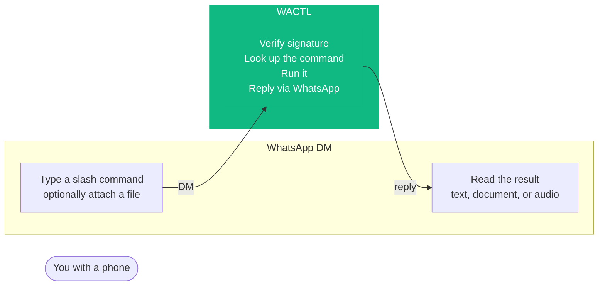
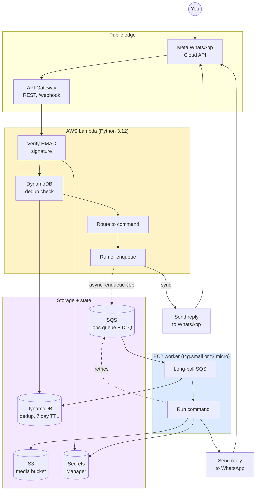
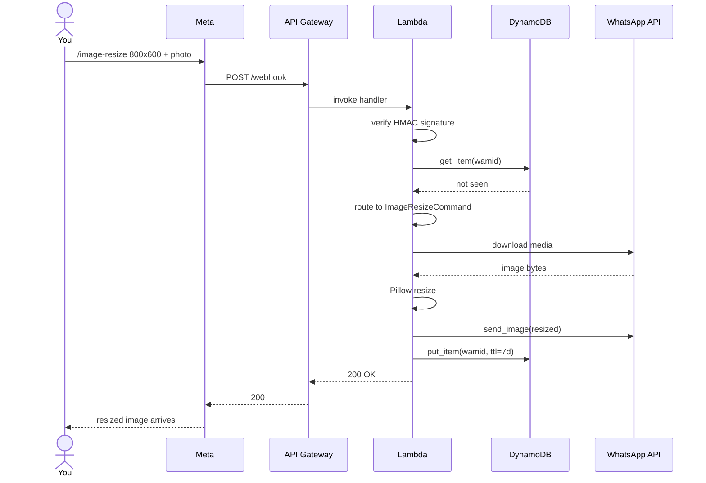
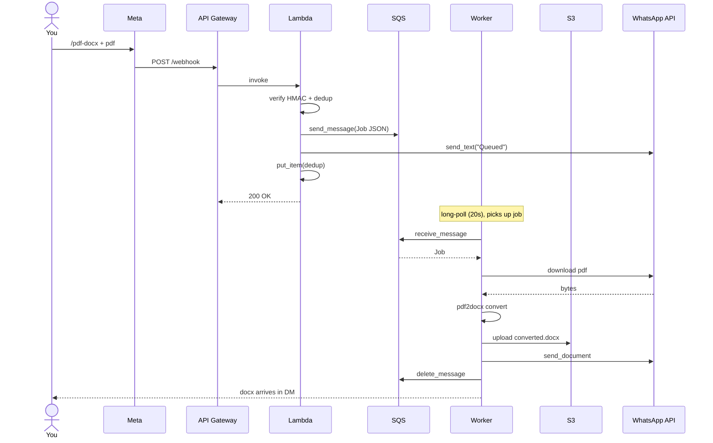
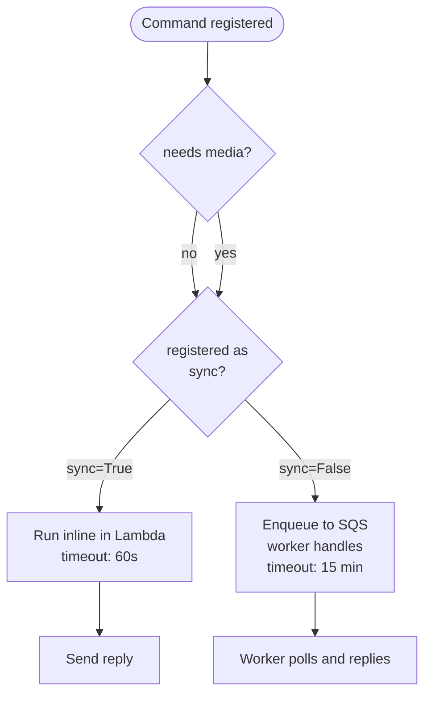
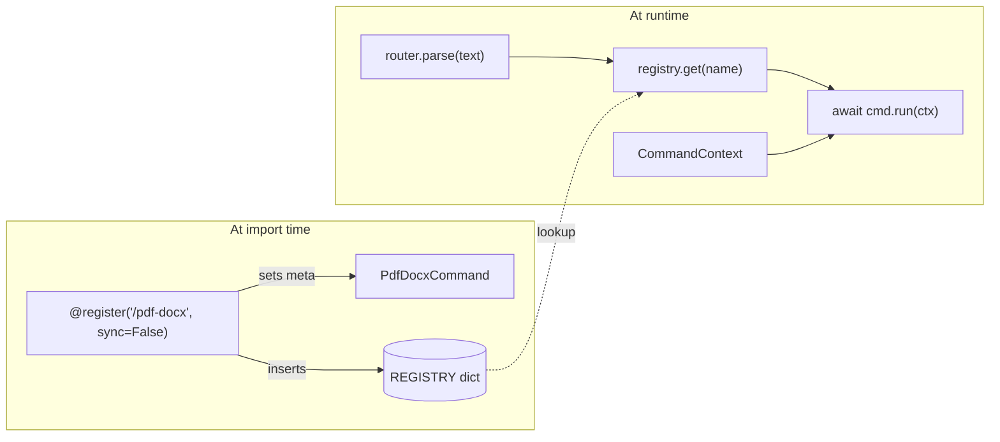
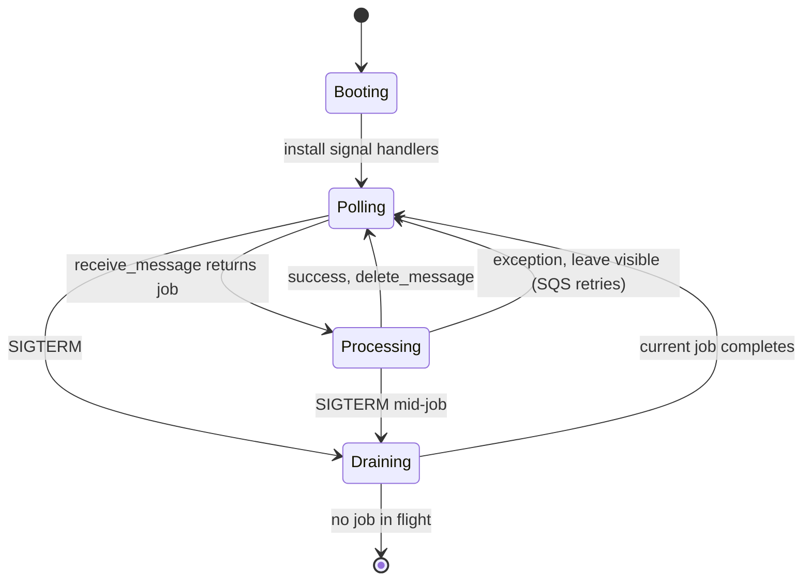
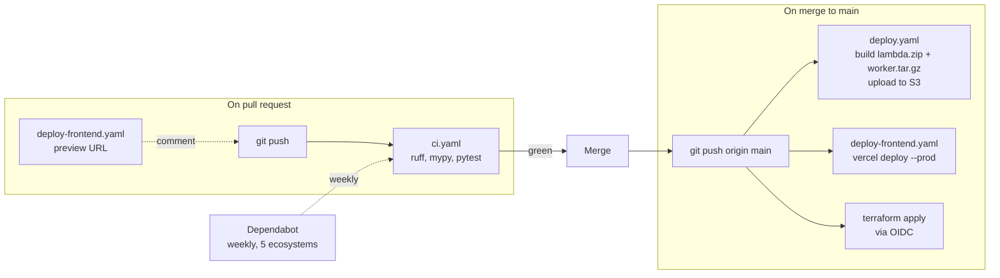
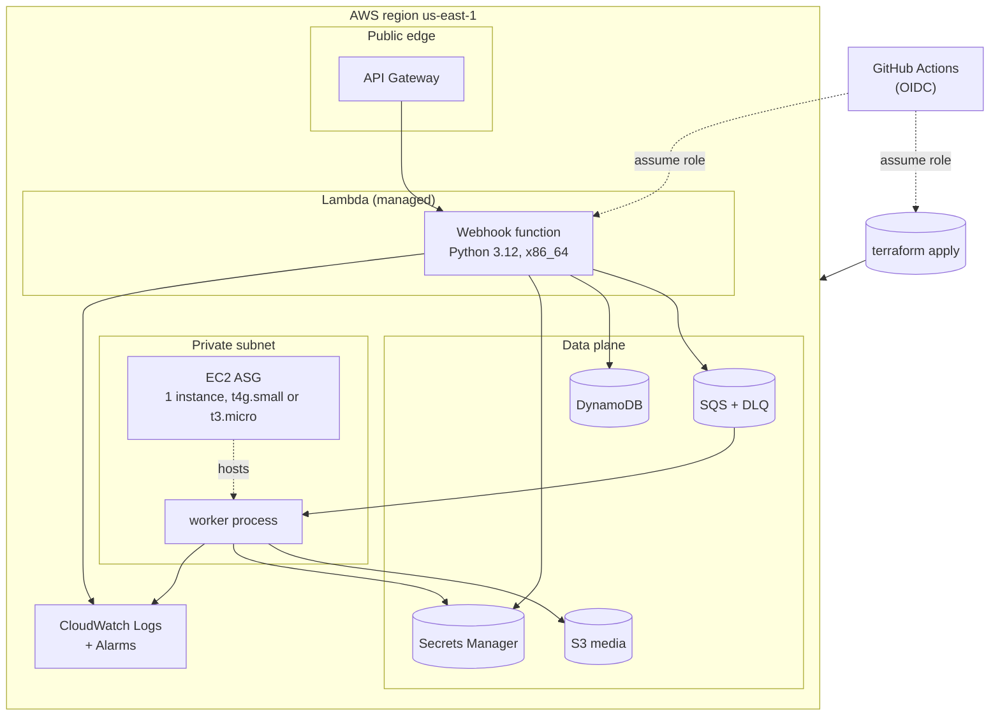

# WACTL

A WhatsApp bot that converts files, summarises links, and translates text. You send a slash command in a DM. It replies in the same chat with the result.

---

## 1. What you see



Capabilities: PDF to DOCX, PDF to audio, image resize, image compress, merge PDFs, split PDFs, web page summary, GitHub PR summary, translation.

## 2. System architecture



## 3. Sync command flow

Example: `/image-resize 800x600 + photo`. Lambda runs the command inline and replies within a few seconds.



## 4. Async command flow

Example: `/pdf-docx + pdf`. Lambda replies immediately with a "Queued" message and the worker does the heavy lifting.



## 5. Sync vs async decision



Current split: image tools, summary, translate, github-pr are sync. PDF tools and audio are async.

## 6. Plugin architecture



Adding a command: one file under `src/wactl/commands/`, one line in `commands/__init__.py`. Router and dispatcher never change.

## 7. Worker lifecycle



Visibility timeout is 15 min: a job that the worker fails to ack in that window is re-delivered to the next poll cycle or another instance.

## 8. Storage layout

```mermaid
erDiagram
    DEDUP {
        string pk "wamid.HkAD..."
        int expires_at "TTL 7 days"
        string source "whatsapp"
    }

    SQS_MESSAGE {
        string handle "_receipt_handle"
        string body "Job JSON (command + user + media_id)"
    }

    S3_OBJECT {
        string key "jobs/abc/input.pdf"
        int size_bytes
        string content_type
    }

    SECRET {
        string name "wactl/whatsapp/access-token"
    }

    SQS_MESSAGE ||..|| DEDUP : same wamid blocks re-dispatch
    SQS_MESSAGE ||..|| S3_OBJECT : media downloaded by worker
    SECRET ||..o{ SQS_MESSAGE : bearer + app secret read at startup
```

S3 lifecycle drops objects after 24 hours. DynamoDB TTL drops dedup rows after 7 days (matching Meta's retry window).

## 9. CI/CD



No long lived AWS keys. CI assumes roles via OIDC (`sub` claim restricted to `repo:sathya-narayanan/wactl:ref:refs/heads/main`).

## 10. Deployment topology



---

## Tech stack

### Backend

| Component        | Choice                  | Notes                                                          |
|------------------|-------------------------|----------------------------------------------------------------|
| Runtime          | Python 3.12             | matches `.python-version`                                      |
| HTTP client      | httpx (async)           | injected for testability                                       |
| AWS SDK          | boto3                   | clients are module level singletons                            |
| Models           | Pydantic v2             | `frozen=True` value objects                                    |
| Settings         | pydantic-settings       | env vars + Secrets Manager references                           |
| Logging          | structlog               | JSON logs with bound context (job_id, command, user_phone)      |
| Concurrency      | asyncio                 | `asyncio.run` for sync entry, `asyncio.to_thread` for boto3    |
| Retry            | tenacity                | exponential backoff on 429/5xx for WhatsApp calls              |
| Package manager  | uv                      | lockfile pinned, `uv export` for Lambda zip                    |

### Frontend

| Component   | Choice       | Notes                                          |
|-------------|--------------|------------------------------------------------|
| Framework   | Next.js 16   | App Router, React 19                           |
| Styling     | Tailwind v4  | utility classes, no shadcn install required    |
| Deploy      | Vercel       | hobby tier, free                              |
| Language    | TypeScript   | strict mode                                    |

### Infrastructure

| Resource           | Type                          | Purpose                                       |
|--------------------|-------------------------------|-----------------------------------------------|
| API Gateway        | REST API                      | Webhook receiver (GET verify, POST Lambda)    |
| Lambda             | Python 3.12, x86_64, 512 MB   | Webhook handler                               |
| SQS                | Standard queue + DLQ          | Async job queue                               |
| DynamoDB           | Pay-per-request, TTL          | Wamid dedup, 7 day TTL                        |
| S3                 | Standard, lifecycle           | Media bucket, 24 hour expiry                  |
| Secrets Manager    | 4 secrets                     | WhatsApp tokens, app secret, Gemini key       |
| EC2 ASG            | t4g.small or t3.micro, ARM/x86 | Long-running worker                          |
| CloudWatch         | Logs + metric alarms          | DLQ depth, errors, CPU                        |

### CI/CD

| Workflow                    | Trigger                  | Action                               |
|-----------------------------|--------------------------|--------------------------------------|
| `ci.yaml`                   | PR + push                | ruff, mypy, pytest                   |
| `deploy.yaml`               | push to main             | build Lambda + worker, terraform     |
| `deploy-frontend.yaml`      | push to main with `web/` | Vercel production deploy             |
| Dependabot                  | weekly                   | 5 ecosystems, grouped PRs            |

### Testing

| Tool             | Purpose                                            |
|------------------|----------------------------------------------------|
| pytest           | test runner                                        |
| pytest-asyncio   | async test support (`asyncio_mode=auto`)           |
| respx            | httpx transport mocking                            |
| moto             | AWS service mocking                                |
| ruff             | lint + format                                      |
| mypy             | static type check (strict)                         |

The full suite runs in about 10 seconds with zero AWS credentials.

---

## What WACTL does

A WhatsApp first automation platform for personal tooling. The bot accepts slash commands, optionally with a file attachment, and replies in chat with the processed result.

Concrete examples:

| You send                              | What happens                                                | Reply time |
|---------------------------------------|-------------------------------------------------------------|------------|
| `/image-resize 800x600` + photo       | Pillow resize, reply with new image                         | < 5 s      |
| `/image-compress quality=70` + photo  | Pillow recompress, reply with image                         | < 5 s      |
| `/web-summary https://example.com/x`  | Fetch, strip tags, Gemini summarise                         | 3 to 6 s   |
| `/github-pr https://.../pull/123`     | Fetch PR metadata + diff, Gemini summarise                  | 3 to 8 s   |
| `/translate es:` + text               | Gemini translate to Spanish, reply with text                | 1 to 3 s   |
| `/pdf-docx` + PDF                     | Enqueue SQS job, worker converts, replies with DOCX        | 5 s to 2 m |
| `/pdf-audio` + PDF                    | Enqueue, worker chunks and calls Gemini TTS, merges audio   | 30 s to 5 m|
| `/merge-pdf` + 3 PDFs                 | Worker downloads all, runs pypdf merge, replies with PDF    | 10 to 60 s |
| `/split-pdf` + PDF                    | Worker runs pypdf split, replies with one PDF per page      | 10 to 60 s |

## Why it exists

A portfolio project that demonstrates some specific patterns, not all of AWS:

- A plugin architecture where adding a command is one file and one decorator, with zero changes to the router, dispatcher, or Terraform
- Clean separation between orchestration (commands) and integration with external services (`src/wactl/integrations/`)
- Production AWS patterns: HMAC verification on every webhook, dedup against a 7 day retry window via DynamoDB TTL, least privilege IAM, OIDC for CI/CD, structured logging, graceful worker shutdown on SIGTERM
- Infrastructure as code for the entire deployment (one `terraform apply` builds the environment)

It does not pretend to be a multi tenant SaaS. It is a small platform for a small audience (<= 15 personal users) where the cost ceiling and complexity budget are kept low on purpose.

## Quickstart

Run the test suite:

```bash
uv sync
uv run pytest -q
uv run ruff check src tests worker lambda
uv run mypy src worker lambda
```

No AWS credentials needed. Tests use mocked transport for WhatsApp and `moto` for AWS.

For an actual deploy, follow [docs/SETUP.md](docs/SETUP.md):

1. Bootstrap the Terraform state bucket
2. `terraform apply -var env=dev`
3. Populate the four secrets in Secrets Manager
4. Build the Lambda zip and worker tarball, upload to S3
5. Configure the WhatsApp webhook in the Meta developer dashboard
6. Send `/help` to the bot

## Commands

| Command          | Sync | Needs media | External APIs                |
|------------------|------|-------------|------------------------------|
| `/pdf-docx`      | no   | yes         | pdf2docx                     |
| `/pdf-audio`     | no   | yes         | pdf2docx, pymupdf, Gemini TTS|
| `/merge-pdf`     | no   | yes         | pypdf                        |
| `/split-pdf`     | no   | yes         | pypdf                        |
| `/image-resize`  | yes  | yes         | Pillow                       |
| `/image-compress`| yes  | yes         | Pillow                       |
| `/web-summary`   | yes  | no          | httpx, Gemini text           |
| `/github-pr`     | yes  | no          | httpx (GitHub), Gemini text  |
| `/translate`     | yes  | optional    | Gemini text                  |

## Project links

- Setup guide: [docs/SETUP.md](docs/SETUP.md)
- Architecture tour: [docs/CODEBASE_GUIDE.md](docs/CODEBASE_GUIDE.md)
- Architecture decisions: [docs/DECISIONS.md](docs/DECISIONS.md)
- Contributing: [CONTRIBUTING.md](CONTRIBUTING.md)
- Code of conduct: [CODE_OF_CONDUCT.md](CODE_OF_CONDUCT.md)
- Security policy: [SECURITY.md](SECURITY.md)
- Support: [SUPPORT.md](SUPPORT.md)
- Changelog: [CHANGELOG.md](CHANGELOG.md)

## License

MIT. See [LICENSE](LICENSE).