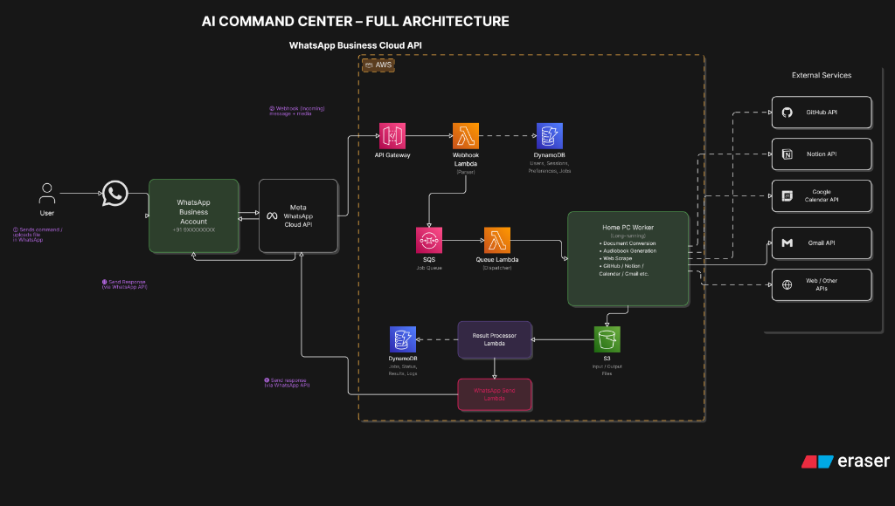

<p align="center">
  
  
  
  
  
</p>

# WACTL — WhatsApp Command-Line Tool

> **Production-grade WhatsApp Cloud API automation platform.**
> DM a WhatsApp Business number with a slash command, optionally attach a file, and get the processed result back — all powered by a serverless + worker architecture on AWS.

WACTL turns your WhatsApp chat into a personal tooling platform. Users send slash commands like `/pdf-docx`, `/image-resize`, `/translate`, or `/web-summary` to a WhatsApp Business number, and the system processes the request — either instantly within AWS Lambda (synchronous) or via an SQS-powered EC2 worker (asynchronous) — and replies directly in the chat with the result.

---

## Table of Contents

- [What WACTL Does](#what-wactl-does)
- [Tech Stack](#tech-stack)
- [Architecture Overview](#architecture-overview)
- [How the Entire Process Works](#how-the-entire-process-works)
- [Synchronous vs Asynchronous — Explained](#synchronous-vs-asynchronous--explained)
- [AWS Services — Where & Why](#aws-services--where--why)
- [Available Commands](#available-commands)
- [Plugin Architecture — The Command Registry](#plugin-architecture--the-command-registry)
- [Project Structure](#project-structure)
- [Local Development](#local-development)
- [Deployment](#deployment)
- [CI/CD](#cicd)
- [License](#license)

---

## What WACTL Does

WACTL is a **WhatsApp-first personal-tooling platform**. The user DMs a WhatsApp Business number, types a slash command (e.g., `/pdf-docx`, `/image-resize 800x600`, `/translate es Hello world`), optionally attaches a file, and gets the processed result back in the same chat.

**Key capabilities:**

- **Document conversion** — PDF → DOCX, PDF splitting, PDF merging
- **Image processing** — Resize and compress images on the fly
- **Audio generation** — Convert PDFs to audiobooks via Gemini TTS
- **Web summarization** — Fetch any URL and get an AI-powered summary
- **Translation** — Translate text between languages using Gemini
- **GitHub integration** — Summarize pull requests

The backend intelligently decides whether to process a command **synchronously** (fast, inline within Lambda) or **asynchronously** (heavy workloads offloaded to an EC2 worker via SQS). Both execution paths share the same core Python package (`src/wactl/`) and deliver results back via the WhatsApp Cloud API.

---

## Tech Stack

| Layer | Technology | Purpose |
|---|---|---|
| **Runtime** | Python 3.12 | Core backend language |
| **HTTP Client** | `httpx` (async) | All outbound HTTP calls (WhatsApp API, web fetching) |
| **AWS SDK** | `boto3` | S3, SQS, DynamoDB, Secrets Manager interactions |
| **Data Modeling** | `pydantic` v2 + `pydantic-settings` | Request/response validation, settings from env vars |
| **Logging** | `structlog` | JSON structured logging with contextual binding |
| **LLM / TTS** | `google-genai` (Gemini) | Text summarization, translation, text-to-speech |
| **PDF Processing** | `pdf2docx`, `pymupdf`, `pypdf` | PDF → DOCX, page splitting, merging |
| **Image Processing** | `Pillow` | Resize, compress, format conversion |
| **HTML Parsing** | `beautifulsoup4`, `markdownify`, `lxml` | Web page extraction for `/web-summary` |
| **Audio** | `pydub` | Audio concatenation for audiobook pipeline |
| **Retry Logic** | `tenacity` | Exponential backoff for WhatsApp 429 responses |
| **Serverless** | AWS Lambda (Python 3.12) | Webhook handler + sync command execution |
| **Compute** | AWS EC2 (t4g.nano, ARM64) | Long-running SQS worker for async commands |
| **Queue** | AWS SQS (Standard) | Job queue between Lambda and EC2 worker |
| **Storage** | AWS S3 | Media files (input/output) + release artifacts |
| **Dedup** | AWS DynamoDB | Idempotent message processing (7-day TTL) |
| **Secrets** | AWS Secrets Manager / SSM Parameter Store | WhatsApp tokens, API keys |
| **API** | AWS API Gateway (REST) | HTTPS endpoint for Meta webhook callbacks |
| **Monitoring** | AWS CloudWatch | Log groups, alarms (DLQ depth, Lambda errors, CPU) |
| **Scheduling** | AWS EventBridge | Daily cleanup cron (stub for v1) |
| **IaC** | Terraform 1.10+ | All AWS resources, S3 backend with native lock |
| **Frontend** | Next.js 16 + Tailwind CSS v4 | Landing page, docs, privacy/terms (Vercel) |
| **CI/CD** | GitHub Actions + OIDC | Automated lint, test, build, deploy — zero long-lived keys |
| **Package Manager** | `uv` | Fast Python dependency management |

---

## Architecture Overview

Below is the full architecture diagram of the system:



### Reading the Diagram — Step by Step

The numbered steps in the architecture diagram trace the lifecycle of every WhatsApp message through the system:

| Step | What Happens | Component |
|------|---|---|
| **①** | User sends a message or uploads a file in WhatsApp | WhatsApp client |
| **②** | Meta's servers POST the webhook payload (message + metadata) to our registered callback URL | Meta WhatsApp Cloud API |
| **③** | AWS API Gateway receives the HTTPS request and proxies it to Lambda | API Gateway (REST) |
| **④** | The Webhook Lambda parses the envelope, verifies the HMAC signature, deduplicates the message ID via DynamoDB, and routes the text to the correct command | Lambda + DynamoDB |
| **⑤** | For **async commands** (`sync=False`), the dispatcher serializes a `Job` and pushes it onto the SQS jobs queue. Lambda replies with a "queued" acknowledgment immediately | SQS |
| **⑥** | The Queue Lambda / dispatcher routes the job to the appropriate worker | Lambda → SQS |
| **⑦** | The EC2 Worker (long-running process) picks up the job via SQS long-poll and executes the command — document conversion, audio generation, etc. | EC2 |
| **⑧** | The worker reads input files from and writes output files to S3 | S3 |
| **⑨** | The result is processed — job status, logs, and results are tracked | Result processing |
| **⑩** | The response is prepared for delivery via the WhatsApp Send Lambda | Lambda |
| **⑪** | The response (text, document, image, audio) is sent back through the WhatsApp Cloud API | WhatsApp Cloud API |
| **⑫** | The user receives the processed result in their WhatsApp chat | WhatsApp client |

### Shared Services (Bottom of Diagram)

| Service | Role |
|---|---|
| **CloudWatch** | Centralized JSON logs + metric alarms for Lambda errors, DLQ depth, worker CPU |
| **Secrets Manager** | Stores WhatsApp access token, app secret, verify token, Gemini API key |
| **Cognito** | Optional auth for a future web dashboard |
| **EventBridge** | Daily scheduled cleanup of the DynamoDB dedup table (stub in v1) |
| **SNS** | Alert notifications (email/Slack) when CloudWatch alarms fire |
| **CloudFront** | File distribution (planned for future use) |

### External Services (Right Side of Diagram)

WACTL integrates with external APIs for specific commands:

- **GitHub API** — `/github-pr` fetches PR diffs and metadata
- **Notion API** — Planned integration
- **Google Calendar API** — Planned integration
- **Gmail API** — Planned integration
- **Web / Other APIs** — `/web-summary` fetches and parses public web pages

---

## How the Entire Process Works

The system operates as a **webhook-driven event pipeline**. Here's the full lifecycle from message to response:

### 1. Webhook Reception

```
User WhatsApp → Meta Cloud API → API Gateway (HTTPS) → Lambda
```

Meta's WhatsApp Cloud API sends a POST to the API Gateway URL registered in the Meta Developer dashboard. API Gateway proxies the entire request (headers + body) to the Lambda function using the `AWS_PROXY` integration type.

### 2. Signature Verification

The Lambda's first action is **HMAC-SHA256 verification**. Meta signs every webhook payload with the app secret:

```python
# X-Hub-Signature-256: sha256=<hex>
expected = hmac.new(app_secret, msg=raw_body, digestmod=sha256).hexdigest()
hmac.compare_digest(expected, provided)  # constant-time comparison
```

If the signature doesn't match, the request is logged and dropped (but we still return HTTP 200 — returning non-200 would cause Meta to retry for up to 7 days).

### 3. Parse & Deduplicate

The webhook payload is parsed into structured `ParsedMessage` objects. Each message has a unique `wamid` (WhatsApp Message ID). Before processing, the handler performs a **conditional put** on DynamoDB:

```
DynamoDB table: wactl-<env>-dedup
Partition key:  pk = <wamid>
TTL:            expires_at = now + 7 days
```

If the `wamid` already exists (claimed by a previous invocation), the message is silently dropped. This makes the system **idempotent** against Meta's at-least-once delivery guarantee.

### 4. Route & Dispatch

The message text is parsed into `(command_name, args)`:

```
"/image-resize 800x600"  →  name="/image-resize", args="800x600"
"/pdf-docx"              →  name="/pdf-docx",      args=""
```

The command name is looked up in the **decorator registry** (`_REGISTRY` dict). Each registered command declares `sync: bool`, which determines the execution path.

### 5a. Sync Execution (Lambda Inline)

For `sync=True` commands, the dispatcher runs the command **directly inside the Lambda invocation**:

```
Lambda → download media (if needed) → run command → upload result to S3 → send reply via WhatsApp API → return 200
```

Total latency: typically 1-10 seconds. Lambda has a 60-second timeout configured.

### 5b. Async Execution (SQS → EC2 Worker)

For `sync=False` commands, the dispatcher:

1. Serializes a `Job` (command name, args, user context, media metadata) as JSON
2. Sends the job to the SQS queue (`sqs.send_message`)
3. Sends an immediate "⏳ Queued…" reply to the user via WhatsApp
4. Returns 200 to API Gateway

The EC2 worker picks it up:

```
EC2 Worker (long-poll SQS, 20s wait) → receive message → deserialize Job
→ rebuild dependencies → run command → upload to S3 → reply via WhatsApp
→ delete SQS message
```

If the command fails, the message returns to the queue after the visibility timeout (15 min). After 5 failures, it moves to the **Dead Letter Queue (DLQ)**.

---

## Synchronous vs Asynchronous — Explained

The sync/async split is the core architectural decision. Each command declares its execution mode via a single `sync: bool` flag in the `@register` decorator.

### Synchronous Commands (`sync=True`) — Run in Lambda

**When to use:** The command completes in < 60 seconds and doesn't need heavy compute or large file processing.


**How it works:**
1. The Lambda handler calls `dispatch_sync(routed, ...)` directly
2. The dispatcher builds a `CommandContext` with all dependencies (WhatsApp client, HTTP client, Gemini client, S3 client)
3. If the command `requires_media=True`, the dispatcher downloads the media attachment from WhatsApp's CDN
4. The command's `run(ctx)` method executes inline
5. The command uploads any output to S3, generates a presigned URL, and sends the result back via the WhatsApp API
6. Lambda returns `{"statusCode": 200}` to API Gateway

**Characteristics:**
- Response time: 1-10 seconds
- Lambda timeout: 60 seconds
- Pay-per-invocation (Lambda free tier: 1M requests/month)
- No queue hop, no worker involvement

### Asynchronous Commands (`sync=False`) — Enqueued to SQS → EC2 Worker

**When to use:** The command is compute-heavy, takes > 10 seconds, involves large files, or requires sustained processing.


**How it works:**
1. The Lambda handler calls `dispatch_async(routed, ...)` which serializes a `Job` object and pushes it to SQS
2. Lambda sends an immediate "queued" acknowledgment to the user
3. Lambda returns 200 — total Lambda time is < 500ms
4. The EC2 worker runs a continuous `while not shutdown.is_set()` loop that long-polls SQS with a 20-second wait
5. When a message arrives, the worker deserializes the `Job`, rebuilds dependencies (WhatsApp client, HTTP, Gemini — using `build_deps()`), and calls `cmd.run(ctx)`
6. On success, the worker deletes the SQS message
7. On failure, the message becomes visible again after the 15-minute visibility timeout for retry

**Characteristics:**
- Processing time: 5 seconds to 15 minutes
- Automatic retries (5 attempts before DLQ)
- EC2 t4g.nano always-on: ~$3/month
- SIGTERM-aware graceful shutdown for deployments

### Sync vs Async — Command Map

| Command | Mode | Why |
|---|---|---|
| `/image-resize` |  Sync | Pillow resize < 2s, small payloads |
| `/image-compress` |  Sync | Quality reduction is instant |
| `/web-summary` | Sync | HTTP fetch + one Gemini call < 10s |
| `/translate` |  Sync | Single Gemini API call |
| `/github-pr` |  Sync | GitHub API fetch + Gemini summary |
| `/pdf-docx` |  Async | `pdf2docx` takes 5-30s on multi-page docs |
| `/pdf-audio` |  Async | TTS fan-out across chunks: 30-120s |
| `/merge-pdf` |  Async | Multiple file downloads + merge |
| `/split-pdf` |  Async | Page extraction + multi-file upload |

### Key Design Insight

Both sync and async commands **share the same `Command` base class, the same `CommandContext`, and the same `run(ctx)` method signature**. The _only_ difference is where `run()` is called — Lambda vs EC2. This means:

- A command can be switched from sync to async (or vice versa) by changing **one boolean** in the `@register` decorator
- No code changes are needed in the command implementation itself
- The worker reuses `build_deps()` to construct the exact same dependency graph

---

## AWS Services — Where & Why

### AWS Lambda

**File:** [`lambda.tf`](infra/lambda.tf) | **Handler:** [`handler.py`](lambda/webhook/handler.py)

| Property | Value |
|---|---|
| Runtime | Python 3.12 (x86_64) |
| Memory | 512 MB |
| Timeout | 60 seconds |
| Trigger | API Gateway REST (POST + GET `/webhook`) |

**What it does:**
- Receives every WhatsApp webhook from Meta via API Gateway
- Verifies HMAC signatures (security)
- Deduplicates messages via DynamoDB (idempotency)
- Runs sync commands inline (image resize, translate, web summary)
- Enqueues async commands to SQS (PDF conversion, audio generation)
- Always returns HTTP 200 to prevent Meta's 7-day retry storm

**Cold start optimization:**
- Dependencies are built lazily via `_get_deps()` — a singleton that persists across Lambda container reuse
- Imports like `httpx`, `GeminiClient`, `WhatsAppClient` are lazy (only when first needed)
- The handler module is intentionally thin — all logic lives in `src/wactl/`

### Amazon EC2

**File:** [`ec2.tf`](infra/ec2.tf) | **Worker:** [`main.py`](worker/main.py)

| Property | Value |
|---|---|
| Instance type | t4g.nano (ARM64 Graviton) |
| AMI | Amazon Linux 2023 |
| ASG | Min=1, Max=2, Desired=1 |
| Cost | ~$3/month |

**What it does:**
- Runs the `worker.main.Worker` process as a systemd service
- Long-polls SQS for async jobs (20-second wait per poll)
- Executes heavy commands (PDF conversion, TTS audio generation)
- Downloads media from WhatsApp, processes it, uploads results to S3
- Sends the final reply to the user via the WhatsApp Cloud API
- Handles SIGTERM gracefully — drains the in-flight job before exiting

**Provisioning flow:**
1. Terraform creates a Launch Template + ASG
2. cloud-init on first boot:
   - Installs Python 3.12, creates a `wactl` system user
   - Downloads `worker.tar.gz` from the S3 releases bucket
   - Installs a systemd unit (`wactl-worker.service`)
   - Starts the worker

**Why EC2 over Lambda/Fargate:**
- Lambda would need Provisioned Concurrency ($$$) or suffer cold starts per job
- Fargate adds container orchestration overhead
- EC2 t4g.nano is the cheapest option for a steady-state, always-on worker

### Amazon S3

**File:** [`s3.tf`](infra/s3.tf)

Two buckets, both with public access blocked and server-side encryption (AES-256):

| Bucket | Purpose | Lifecycle |
|---|---|---|
| `wactl-<env>-media-<account>` | Stores downloaded attachments and processed output files (resized images, converted documents, audio) | Auto-expire after **1 day** |
| `wactl-<env>-releases-<account>` | Holds `lambda.zip` and `worker.tar.gz` deployment artifacts | Non-current versions expire after **30 days** |

**How S3 is used in the data flow:**
1. **Upload:** After a command processes media (e.g., resize an image), the output bytes are uploaded to the media bucket with `s3.put_object()`
2. **Presigned URL:** A time-limited presigned URL is generated with `s3.presigned_get_url()` — this URL is sent to the user via WhatsApp so they can download the file
3. **Worker bootstrap:** The EC2 cloud-init script downloads `worker.tar.gz` from the releases bucket on first boot

### Amazon SQS

**File:** [`sqs.tf`](infra/sqs.tf)

| Queue | Purpose | Config |
|---|---|---|
| `wactl-<env>-jobs` | Main job queue for async commands | Retention: 4 days, Visibility: 15 min, Long-poll: 20s, SSE enabled |
| `wactl-<env>-jobs-dlq` | Dead Letter Queue for failed jobs | Retention: 14 days, Max receives: 5 |

**How SQS connects Lambda ↔ EC2:**

```
Lambda (dispatch_async)           EC2 Worker (long-poll)
        │                                 │
        ├── serialize Job to JSON         │
        ├── sqs.send_message() ─────────► │ sqs.receive_message()
        ├── reply "queued" to user        │ deserialize Job
        └── return 200                    ├── cmd.run(ctx)
                                          ├── reply via WhatsApp API
                                          └── sqs.delete_message()
```

**Why SQS Standard (not FIFO):**
- Jobs are independent — no ordering requirement
- At-least-once delivery is fine because DynamoDB dedup catches duplicates
- Unlimited throughput (FIFO caps at 300 msg/s)

### Amazon DynamoDB

**File:** [`dynamodb.tf`](infra/dynamodb.tf)

| Property | Value |
|---|---|
| Table name | `wactl-<env>-dedup` |
| Partition key | `pk` (String) — the WhatsApp message ID (`wamid`) |
| Billing | Pay-per-request (no capacity planning) |
| TTL | `expires_at` — auto-deletes rows after 7 days |
| PITR | Enabled (point-in-time recovery) |

**Purpose:** Prevents duplicate processing. Meta retries webhook delivery for up to 7 days on non-200 responses. Even with 200 responses, at-least-once delivery means the same `wamid` can arrive multiple times. The Lambda does a conditional put (`try_claim`) — if the row already exists, the message is dropped.

### AWS API Gateway (REST)

**File:** [`apigateway.tf`](infra/apigateway.tf)

- **Type:** REST API (not HTTP API) — chosen for native `binary_media_types` support
- **Endpoints:**
  - `GET /webhook` — Meta's verification handshake (echoes `hub.challenge`)
  - `POST /webhook` — Receives all WhatsApp webhook payloads
- **Integration:** `AWS_PROXY` → Lambda (passes full request including headers for HMAC verification)
- **Binary media types:** Supports PDF, DOCX, OGG, MPEG, JPEG, PNG, WebP

### AWS Secrets Manager / SSM Parameter Store

**File:** [`secrets.tf`](infra/secrets.tf)

Stores sensitive credentials as SecureString parameters:

| Secret | Purpose |
|---|---|
| `wactl/whatsapp/access-token` | WhatsApp system-user token for sending messages |
| `wactl/whatsapp/app-secret` | HMAC key for webhook signature verification |
| `wactl/whatsapp/verify-token` | Token echoed during Meta's webhook registration handshake |
| `wactl/gemini/api-key` | Google Gemini API key for LLM + TTS |

Lambda and EC2 environment variables hold only the **secret names**, never the values. At runtime, `secrets.get_secret(name)` fetches the actual value.

### Amazon CloudWatch

**File:** [`cloudwatch.tf`](infra/cloudwatch.tf)

**Log groups:**
- `/aws/lambda/wactl-<env>-webhook` — Lambda structured JSON logs (30-day retention)
- `/wactl/<env>/worker` — EC2 worker logs (30-day retention)

**Alarms:**
| Alarm | Trigger | Meaning |
|---|---|---|
| DLQ depth ≥ 1 | Messages in the Dead Letter Queue | Jobs are failing repeatedly |
| Lambda errors ≥ 1 | Lambda function errors | Webhook handler is throwing exceptions |
| Worker CPU > 80% for 15 min | High CPU on EC2 | Possible runaway job or backlog |

### Amazon EventBridge

**File:** [`eventbridge.tf`](infra/eventbridge.tf)

A daily cron rule (`cron(0 3 * * ? *)` — 03:00 UTC) for DynamoDB dedup table cleanup. Currently **disabled** (stub for v1) — the TTL auto-expire handles cleanup for now.

---

## Available Commands

| Command | Description | Mode | Requires Media |
|---|---|---|---|
| `/image-resize <WxH>` | Resize an image to specified dimensions | Sync |  Yes |
| `/image-compress` | Compress an image to reduce file size |  Sync |  Yes |
| `/web-summary <URL>` | Fetch a web page and summarize it with AI |  Sync |  No |
| `/translate <lang> <text>` | Translate text to a target language |  Sync |  No |
| `/github-pr <URL>` | Summarize a GitHub pull request |  Sync |  No |
| `/pdf-docx` | Convert a PDF to DOCX format |  Async |  Yes |
| `/pdf-audio` | Convert a PDF to an audiobook (TTS) |  Async |  Yes |
| `/merge-pdf` | Merge multiple PDFs into one |  Async |  Yes |
| `/split-pdf <ranges>` | Split a PDF by page ranges |  Async |  Yes |

---

## Plugin Architecture — The Command Registry

Adding a new command is designed to be **frictionless** — one file, one decorator, zero router/dispatcher changes.

### How It Works

```python
# src/wactl/commands/my_thing.py
from wactl.commands.base import Command, CommandContext
from wactl.commands.registry import register
from wactl.models.command import CommandResponse

@register("/my-thing", sync=True, description="Does the thing.")
class MyThingCommand(Command):
    async def run(self, ctx: CommandContext) -> CommandResponse:
        # Access ctx.whatsapp, ctx.gemini, ctx.s3, ctx.http, etc.
        return CommandResponse(success=True)
```

The `@register` decorator:
1. Attaches `CommandMeta` (name, sync, requires_media, description) to the class
2. Inserts the class into a process-global `_REGISTRY` dict
3. The router looks up commands by name at request time
4. The dispatcher checks `meta.sync` to decide Lambda vs SQS

### To Add a New Command

1. Create `src/wactl/commands/<name>.py` with the class + decorator
2. Add `from wactl.commands import <name>` to `src/wactl/commands/__init__.py`
3. Add a unit test in `tests/unit/test_<name>.py`
4. Add an entry to `web/lib/site.ts` (COMMANDS array) for the docs page

**That's it** — no router changes, no dispatcher changes, no Terraform.

---

## Project Structure

```
wactl/
├── src/wactl/                 # Shared Python package (Lambda + Worker)
│   ├── config.py              # pydantic-settings; reads env vars
│   ├── logging.py             # structlog config + contextvars helper
│   ├── exceptions.py          # WactlError hierarchy
│   ├── constants.py           # Version constants, MIME types
│   ├── webhook.py             # Lambda entry: parse → dedup → route → dispatch
│   ├── router.py              # Text → RoutedCommand (name + class + args)
│   ├── dispatcher.py          # sync/async decision + context builder
│   ├── models/                # Pydantic models (Job, User, Command, Webhook)
│   ├── integrations/
│   │   ├── aws/               # S3, SQS, DynamoDB, Secrets clients
│   │   ├── whatsapp/          # WhatsApp client, messages, media, parser
│   │   ├── converters/        # PDF→DOCX, image resize/compress
│   │   ├── gemini/            # Gemini client (text, TTS)
│   │   ├── github/            # PR summary
│   │   └── web/               # Web page fetcher + extractor
│   ├── commands/              # @register-decorated command plugins
│   └── services/              # Multi-step workflows (audiobook pipeline)
│
├── lambda/                    # Lambda entry points (thin wrappers)
│   ├── webhook/handler.py     # lambda_handler → wactl.webhook.handle()
│   └── scheduler/handler.py   # EventBridge cleanup (stub)
│
├── worker/                    # EC2 worker process
│   ├── main.py                # Long-poll SQS + dispatch loop
│   ├── shutdown.py            # SIGTERM/SIGINT graceful handlers
│   ├── Dockerfile             # Multi-stage build → worker.tar.gz
│   ├── build.sh               # Docker-based builder script
│   └── systemd/               # wactl-worker.service unit file
│
├── infra/                     # Terraform (all AWS resources)
│   ├── apigateway.tf          # REST API + /webhook endpoints
│   ├── lambda.tf              # Webhook Lambda function
│   ├── sqs.tf                 # Jobs queue + DLQ
│   ├── dynamodb.tf            # Dedup table with TTL
│   ├── s3.tf                  # Media + releases buckets
│   ├── ec2.tf                 # Launch template + ASG + cloud-init
│   ├── iam.tf                 # Roles + policies + OIDC
│   ├── secrets.tf             # SSM SecureString parameters
│   ├── cloudwatch.tf          # Log groups + alarms
│   ├── eventbridge.tf         # Daily cleanup cron (disabled)
│   └── backend.tf             # S3 state backend
│
├── web/                       # Next.js 16 + Tailwind v4 (Vercel)
│   ├── app/                   # Pages: landing, docs, privacy, terms
│   ├── components/            # QR code SVG, shared UI
│   └── lib/site.ts            # Constants, command list, wa.me link
│
├── tests/
│   ├── unit/                  # Per-module tests, mocked dependencies
│   └── integration/           # End-to-end webhook + worker tests
│
├── docs/
│   ├── CODEBASE_GUIDE.md      # Architecture tour for engineers
│   ├── DECISIONS.md           # Lightweight ADRs
│   ├── SETUP.md               # Full setup walkthrough
│   └── architectureV1.png     # Architecture diagram
│
├── pyproject.toml             # Dependencies + tool configs (ruff, mypy, pytest)
└── .github/workflows/         # CI + deploy pipelines
```

---

## Local Development

### Prerequisites

| Tool | Version |
|---|---|
| Python | 3.12 |
| uv | latest |
| Node | 20+ (frontend only) |
| Terraform | 1.10+ (infra only) |
| Docker | 24+ (worker build only) |

### Quick Start

```bash
# Clone
git clone https://github.com/sathya-narayanan/wactl
cd wactl

# Install Python dependencies
uv sync

# Run the full test suite (no AWS credentials needed)
uv run pytest tests -q

# Lint + type-check
uv run ruff check src tests worker lambda
uv run mypy src worker lambda

# Frontend
cd web && npm install && npm run dev
```

### Running the Worker Locally

Against the real AWS queue:

```bash
WACTL_ENV=dev \
AWS_REGION=us-east-1 \
WACTL_JOBS_QUEUE=https://sqs.us-east-1.amazonaws.com/<account>/wactl-dev-jobs \
uv run python -m worker.main
```

Fully offline with mocked SQS:

```bash
uv run pytest tests/integration/test_worker.py -q
```

---

## Deployment

See [`docs/SETUP.md`](docs/SETUP.md) for the full bootstrap guide. The short version:

1. **Apply Terraform** — `terraform apply -var env=prod -auto-approve`
2. **Populate secrets** — WhatsApp access token, app secret, verify token
3. **Build + upload** — Lambda zip + worker tarball to S3
4. **Refresh the ASG** — Worker pulls the new tarball on next boot
5. **Configure Meta webhook** — Register the API Gateway URL in the Meta Developer dashboard
6. **Send `/help`** — Test the bot

---

## CI/CD

GitHub Actions handles the entire pipeline via OIDC (no long-lived AWS keys):

| Workflow | Trigger | Steps |
|---|---|---|
| `ci.yaml` | Every push/PR | Lint (ruff) → Type-check (mypy) → Test (pytest) |
| `deploy.yaml` | Push to `main` | Build Lambda zip → Build worker tarball → Upload to S3 → Terraform apply |
| `deploy-frontend.yaml` | Push to `main` (web/ changes) | Deploy Next.js to Vercel |

The OIDC provider + IAM role trust policy restricts the `sub` claim to `repo:sathya-narayanan/wactl:ref:refs/heads/main` — only the `main` branch can deploy.

---

## License

[MIT](LICENSE) © WACTL
