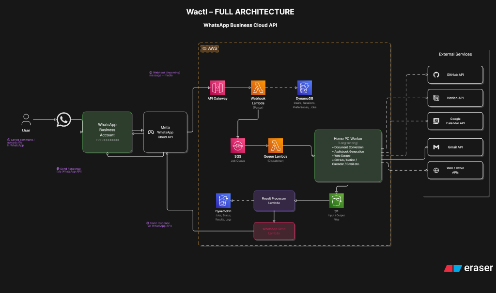

# WACTL

**Telegram Control**

A Telegram bot that turns slash commands into file conversions and audiobooks, backed by a small AWS serverless + EC2 hybrid.

## The idea

WACTL turns Telegram into a file-conversion surface. Send a slash command, attach a file if the command needs one, and the bot replies in the same chat. `/pdf-docx` with a PDF attached gets you back a Word document. `/pdf-audio` with a PDF gets you back an MP3 audiobook. No separate app to install, no new account, no tab switching. If the file or link is already in Telegram, the fix stays in Telegram too.

Underneath, it's a small production-shaped AWS backend: a webhook Lambda for anything that finishes in a couple of seconds, and a single EC2 worker for the slow stuff.

## What it can do

| Command | What it does | Runs on |
|---|---|---|
| `/help` | List available commands | Lambda (sync) |
| `/image-resize <WxH>` | Resize an attached image to fit given dimensions | Lambda (sync) |
| `/image-compress q= max= target=` | Recompress an image to a target quality or size | Lambda (sync) |
| `/pdf-docx` | Convert an attached PDF into a Word document | Lambda (sync) |
| `/pdf-audio` | Turn a PDF into a spoken MP3 audiobook via Gemini TTS | Worker (async) |

Sync commands run inline in the Lambda and finish in a couple of seconds. Only `/pdf-audio` needs the EC2 worker (long runtime + needs system `ffmpeg` for MP3 export).

Five additional commands (`/merge-pdf`, `/split-pdf`, `/translate`, `/web-summary`, `/github-pr`) are still in the source tree but currently disabled. Re-enable by adding the import back to `src/wactl/commands/__init__.py`.

## Architecture

WACTL runs across two compute surfaces (a webhook Lambda and a long-running EC2 worker), two storage surfaces (S3 for media, DynamoDB for webhook dedup) and one FIFO queue (SQS) in between. Fast commands are handled inline by the Lambda; the slow one (`/pdf-audio`) is enqueued and drained by the worker. The Telegram Bot API is the entry and exit point for every message.



## Tech stack

**Backend**

A single Python 3.12 package shared by the Lambda and the worker, with strict typing and linting enforced in CI.

Notable libraries: pydantic and pydantic-settings for config and validation, structlog for structured logging, httpx with tenacity for retries and backoff, boto3 for AWS access, and Pillow, pdf2docx, PyMuPDF, pydub, and google-genai for the actual file conversions and TTS.

**Cloud & infrastructure**

Lambda handles the fast synchronous commands. A single `t4g.nano` EC2 worker long-polls the SQS FIFO queue for `/pdf-audio`. S3 stores media, DynamoDB tracks dedup, and Terraform manages every resource.

**Integrations**

Google Gemini handles text-to-speech for `/pdf-audio`. The Telegram Bot API is used for both inbound webhooks and outbound replies.

**Testing & delivery**

About 180 tests run in well under 5 seconds, with no live AWS calls or network requests anywhere in the suite. `moto` mocks AWS, `respx` mocks HTTP, and `ruff` plus `mypy` (strict mode) enforce lint rules and full type coverage. Dependencies are managed with [uv](https://docs.astral.sh/uv/).

## Project structure

```
wactl/
├── src/wactl/          # the core package (config, logging, webhook, router, dispatcher)
│   ├── commands/        # one file per slash command, registered via a decorator
│   ├── models/          # pydantic value objects
│   ├── integrations/    # aws, telegram, gemini, converters
│   └── services/        # multi-step workflows (e.g. the audiobook pipeline)
├── lambda/webhook/      # the Lambda entry point
├── worker/              # the EC2 worker: long-poll SQS, dispatch, Dockerfile
├── infra/               # Terraform for every AWS resource
├── tests/               # unit and integration tests (pytest, moto, respx)
└── docs/                # SETUP.md, telegram-cheatsheet.md, architecture diagrams
```

## Getting started

Prerequisites: Python 3.12, [uv](https://docs.astral.sh/uv/), Terraform 1.10+, Docker (only for building the worker image).

```bash
git clone https://github.com/sathya-narayanan/wactl.git
cd wactl

# install Python dependencies
uv sync

# copy and fill in environment variables
cp .env.example .env

# run the test suite
uv run pytest
```

The unit tests don't need AWS credentials. Every AWS and HTTP call is mocked. To deploy, follow [`docs/SETUP.md`](docs/SETUP.md).

## Security

- The webhook verifies the optional `X-Telegram-Bot-Api-Secret-Token` header against an env-var shared secret (constant-time compare).
- IAM roles are scoped per component: the Lambda and the worker each get only the permissions they need.
- Telegram bot token and Gemini API key live as plain environment variables on the Lambda / EC2 instance. No Secrets Manager or SSM.
- Both S3 buckets block all public access.

## Cost

The whole platform runs on a single EC2 `t4g.nano` instance (AWS free tier for 12 months) plus a handful of Lambda invocations a day, a FIFO SQS queue with minimal traffic, a 25 GB DynamoDB dedup table, and two S3 buckets with short lifecycle. At personal scale, that's well under a dollar a month after the free tier.

## License

MIT. See `LICENSE`.
